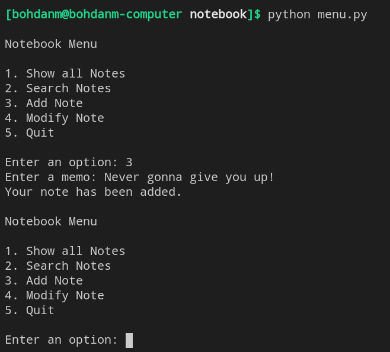

# notebook
A project for emulating a real notebook with notes

## Usage
Run menu.py using python3 command to enter user interface. Or colne this repository and use provided implementations of classes Note and Notebook in notebook.py.

When menu.py is run, user is given several options to choose from. They are:
1. Show all Notes
2. Search Notes
3. Add Note
4. Modify Note
5. Quit
When user has decided on the option, the corresponding proccessing of Notebook is held.
The following is how the interface in command line looks like:

## Project description
The main parts of the project are the following:
1. menu.py - contains Menu class
2. notebook.py - contains Note and Notebooks classes
